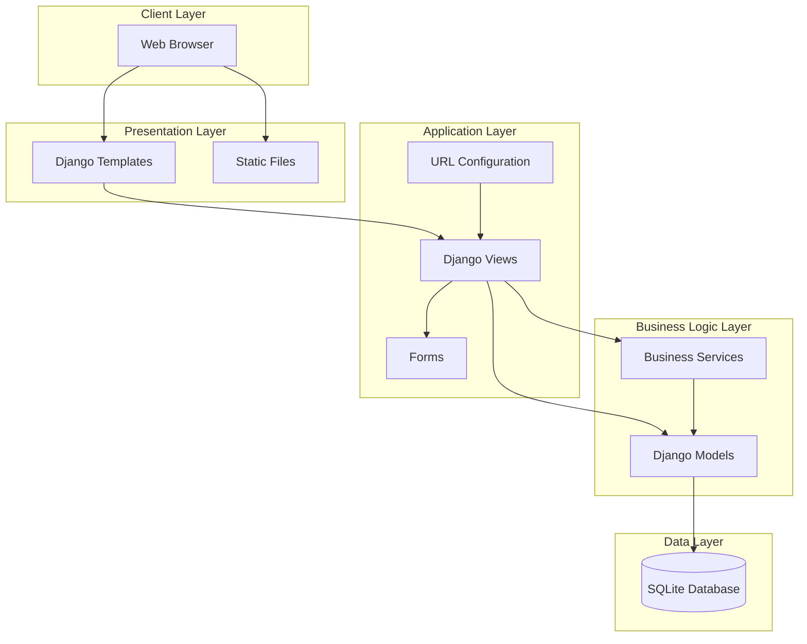

# System Architecture

## Overview
The system follows a layered architecture pattern, implementing the Model-View-Template (MVT) pattern of Django framework. The architecture is designed to be modular, maintainable, and scalable.

## Architecture Diagram

## Component Relationships

### 1. Client Layer
- **Web Browser**: The primary interface for users to interact with the application
- Handles user input and displays responses
- Communicates with the server through HTTP/HTTPS protocols

### 2. Presentation Layer
- **Django Templates**: 
  - Located in `templates/` directory
  - Handles the presentation of data to users
  - Uses Django template language for dynamic content rendering
- **Static Files**:
  - Serves static content (CSS, JavaScript, images)
  - Managed through Django's static file handling system

### 3. Application Layer
- **Views**:
  - Process user requests
  - Implement business logic
  - Return appropriate responses
- **Forms**:
  - Handle data validation
  - Process user input
  - Provide form rendering and processing
- **URL Configuration**:
  - Maps URLs to view functions
  - Manages routing within the application

### 4. Business Logic Layer
- **Models**:
  - Define data structure
  - Handle database operations
  - Implement business rules
- **Services**:
  - Implement complex business logic
  - Coordinate between different components
  - Handle cross-cutting concerns

### 5. Data Layer
- **SQLite Database**:
  - Stores application data
  - Handles data persistence
  - Manages data relationships

## Data Flow
1. User requests are received by the URL configuration
2. Requests are routed to appropriate views
3. Views process requests using models and services
4. Models interact with the database
5. Views render templates with processed data
6. Response is sent back to the client

## Security Considerations
- Django's built-in security features are utilized
- CSRF protection is implemented
- Form validation ensures data integrity
- SQL injection protection through ORM
- XSS protection through template escaping

## Scalability
- Modular design allows for easy component replacement
- Separation of concerns enables independent scaling
- Database operations are optimized through Django ORM
- Static file serving can be delegated to CDN

## Deployment Architecture
- Application can be deployed on various web servers
- Supports horizontal scaling
- Database can be migrated to more robust solutions
- Static files can be served through CDN 